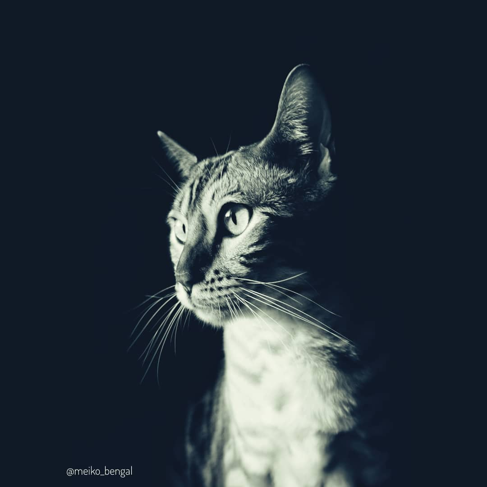

# Meiko Shop 🐱 

Bienvenue dans notre projet. On a realisé un site boutique en ligne, pour la vente de photo de chat.



#### Compte Administrateur
Connectez-vous avec : login :  "meiko.boutique@yopmail.com" | password : "motdepasse" 


## Version en ligne :

https://boutique-des-chats.herokuapp.com

## How-to :
Si vous voulez faire fonctionner ce projet localement, téléchargez ce repository, soit à partir d'un fichier .zip, soit en le clonant.

```bash
bundle install
```
```bash
rails db:create
```
```bash
rails db:migrate
```
```bash
rails db:seed
```
```bash
rails server
```

### Une fois le server connecté, rendez-vous sur : http://localhost:3000/

checkout the website !

Par défaut il n'y aura pas de photos à vendre. 

Pour en ajouter, connectez-vous sur la page Admin, et ajoutez un nouveau produit.

## Team :
Athénais DUPUY https://github.com/AtheDev

Emilie DUFAU https://github.com/EmilieDufau 

Eva AFRIANA https://github.com/evafriana 

Jérémy DELMAS https://github.com/delmasdev

Sofia CHAKIR : https://github.com/sofiachakir
